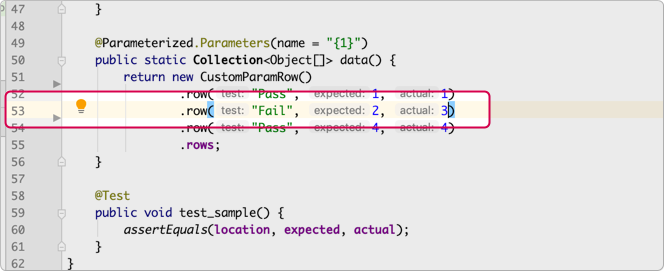

## Console File Caddy

A JetBrains IDE plugin plugin to convert console output text to links for absolute paths,
`file://` or `fqn://` URI with optional `#line:column` anchor refs to specify the line and
column location in the editor.

* Absolute paths in the form: `/...../some-file.ext:xxx` on OS X/Unix systems and
  `x:\....\some-file.ext:xxx` or `x:/..../some-file.ext:xxx` on Windows systems will be
  converted to links.

* `fqn://` protocol followed by a language specific fully qualified class name and optional line
  and column information. This link only requires a fully qualified class name which is
  independent of the physical location of the project.

* The plugin is liberal in recognizing the suffix with `yyy` being line number and `xxx` column
  and will accept `#Lyyy`, `:yyy:xxx`, `(yyy:xxx)`, `[yyy-xxx]` and their permutations.

Great for navigating to file references in console application which outputs absolute file path
with line information.

`fqn://` links are great for generating links in test output, including parameterized tests,
with `assertXXX(message, expected, actual)` assertions. Add an `fqn://` reference for the
file/line/column of the source of the test parameter data and get a failed test with a navigable
link to the data.

Parametrized tests are a PITA to maintain because finding the location of the data for a failed
test is an exercise in frustration. The IDE test console provides a convenient link to the
source of the failed test but not the location of the parameterized data used for the test.

Use something like
[SampleCustomTest.java](test/com/vladsch/plugins/consoleFileCaddy/SampleCustomizedTest.java) in
parameterized tests to generate a link in the message for failed tests. The link will take you
right to the data location, no long search or guesswork.

A simpler one line version, without the hassles of computing column information will navigate to
the start of line for the parameterized data definition
[SampleTest.java](test/com/vladsch/plugins/consoleFileCaddy/SampleTest.java).

Running these tests for this project in IntelliJ will result in a failed test output with a
navigable link to the errant test parameter row:

Navigation takes you right to the location of the data:

